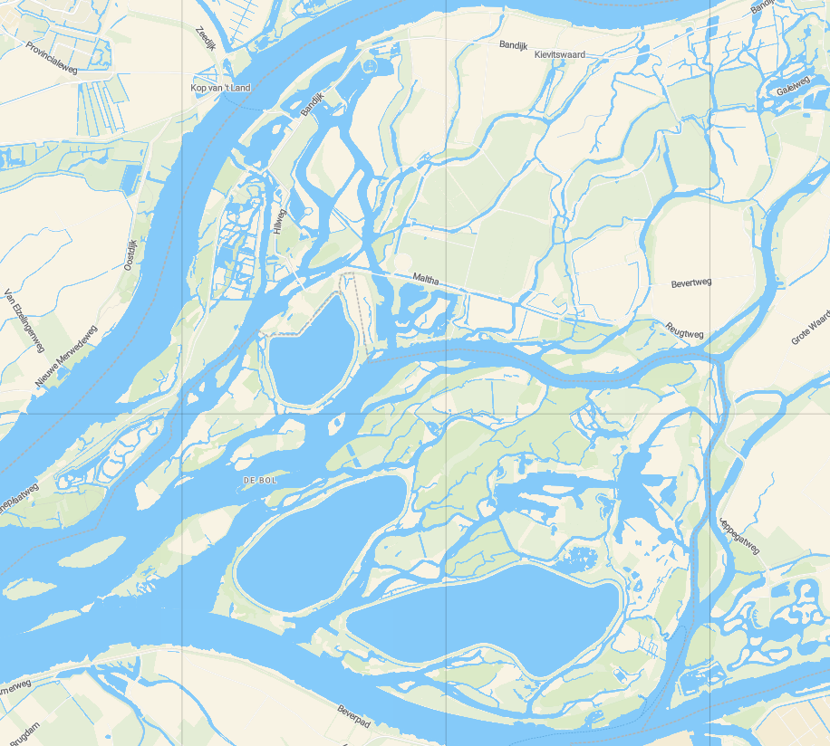

# Networked Embedded Systems Project (5LIC0)

This is a repository of our course Netwoked Embedded Systems project (5LIC0) at Technical University of Eindhoven. The course is scoped perticularly around Wireless Sensor Networks.

## Set up Environment

The project is based on FLoRa 1.1.0 project which is an extension of INET framework for OMNET++ simulator. The following versions are assumed to be installed on the system:
- OMNET++ 6.2.0
- INET 4.4.0
- FLoRa 1.1.0

## Background

The project focuses on the design of a Wireless Sensor Network (WSN) for Wildlife Area Monitoring (WLAM).
The goal of the network/application is to collect environmental data within a wildlife reserve to support ecological investigation.

(Biesbosch National Park, the Netherlands, OpenMaps)

This could be data of temperature, humidity, wildlife activity, and nitrogen dioxide (NO2) levels, all of which provide valuable insights into animal health, 
habitat quality, and potential environmental stressors. As the nodes operates in remote areas, low energy consumption is essential for long-term monitoring.

The project explores the technical challenges of a WSN within wetland environment.

## Research

The network design follows a controlled experimental approach using simulation-based testing with systematic parameter variation.
The decision is made to a utilize simulation platform for initial network design verification. The FLoRa (Framework for LoRa) will be used for end-to-end simulation of LoRa networks.
